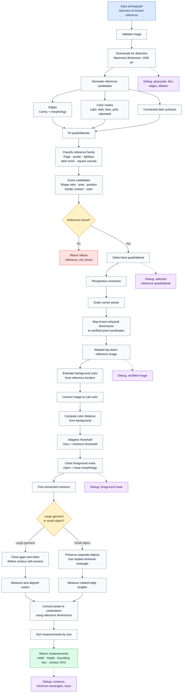

```mermaid
flowchart TD
    A["Input photograph<br/>Garment on known reference"] --> B["Validate image"]
    B --> C["Downscale for detection<br/>Maximum dimension: 1200 px"]

    C --> D["Generate reference candidates"]
    D --> D1["Edges<br/>Canny + morphology"]
    D --> D2["Color masks<br/>Light, dark, blue, pink, saturated"]
    D --> D3["Connected dark surfaces"]

    D1 --> E["Fit quadrilaterals"]
    D2 --> E
    D3 --> E

    E --> F["Classify reference family<br/>Page · poster · lightbox<br/>dark mock · square canvas"]
    F --> G["Score candidates<br/>Shape ratio · area · position<br/>border contact · color"]
    G --> H{"Reference found?"}

    H -- No --> X["Return failure<br/>reference_not_found"]
    H -- Yes --> I["Select best quadrilateral"]

    I --> J["Perspective correction"]
    J --> J1["Order corner points"]
    J1 --> J2["Map known physical dimensions<br/>to rectified pixel coordinates"]
    J2 --> K["Warped top-down reference image"]

    K --> L["Estimate background color<br/>from reference borders"]
    L --> M["Convert image to Lab color"]
    M --> N["Compute color distance<br/>from background"]
    N --> O["Adaptive threshold<br/>Otsu + minimum threshold"]
    O --> P["Clean foreground mask<br/>Open + close morphology"]

    P --> Q["Find connected contours"]
    Q --> R{"Large garment<br/>or small object?"}

    R -- Large garment --> S["Close gaps and holes<br/>Refine contour with erosion"]
    R -- Small object --> T["Preserve separate objects<br/>Use rotated minimum rectangle"]

    S --> U["Measure axis-aligned extent"]
    T --> V["Measure rotated edge lengths"]

    U --> W["Convert pixels to centimeters<br/>using reference dimensions"]
    V --> W

    W --> Y["Sort measurements by size"]
    Y --> Z["Return measurements<br/>width · height · bounding box · contour SVG"]

    C -.-> DB1["Debug: grayscale, blur,<br/>edges, dilation"]
    I -.-> DB2["Debug: selected<br/>reference quadrilateral"]
    K -.-> DB3["Debug: rectified image"]
    P -.-> DB4["Debug: foreground mask"]
    Z -.-> DB5["Debug: contours,<br/>minimum rectangles, trace"]

    classDef input fill:#dbeafe,stroke:#2563eb,color:#172554;
    classDef process fill:#f8fafc,stroke:#64748b,color:#0f172a;
    classDef decision fill:#fef3c7,stroke:#d97706,color:#451a03;
    classDef output fill:#dcfce7,stroke:#16a34a,color:#052e16;
    classDef error fill:#fee2e2,stroke:#dc2626,color:#450a0a;
    classDef debug fill:#f3e8ff,stroke:#9333ea,color:#3b0764;

    class A input;
    class B,C,D,D1,D2,D3,E,F,G,I,J,J1,J2,K,L,M,N,O,P,Q,S,T,U,V,W,Y process;
    class H,R decision;
    class Z output;
    class X error;
    class DB1,DB2,DB3,DB4,DB5 debug;
```